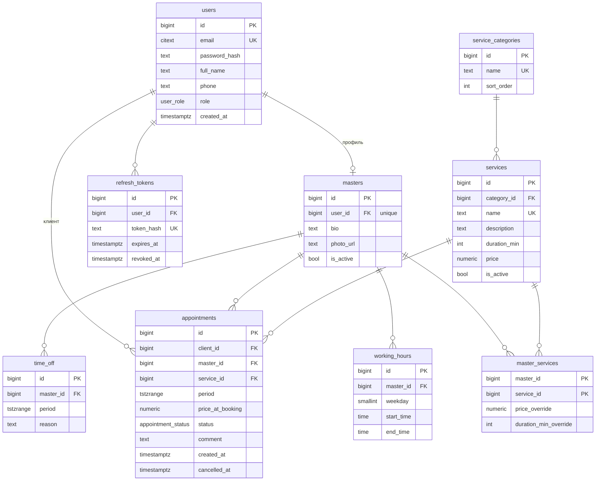

# Онлайн-запись в салон красоты

Fullstack-приложение для записи клиентов к мастерам: публичный каталог, визард
записи в четыре шага, личный кабинет, кабинет мастера и админка с календарём
дня и статистикой.

Главное в проекте — **схема PostgreSQL и защита от двойной записи на уровне
базы данных**. Два клиента физически не могут занять одно время у одного
мастера, даже если их запросы пришли в одну миллисекунду: это гарантирует
ограничение `EXCLUDE USING gist`, а не проверка в коде.

| | |
|---|---|
| **Backend** | Python 3.12 · FastAPI · SQLAlchemy 2.0 (async) + asyncpg · Alembic · Pydantic v2 |
| **Frontend** | React 18 · TypeScript · Vite · TanStack Query · Tailwind v4 · react-hook-form + zod · Recharts |
| **БД** | PostgreSQL 16 · `btree_gist` · `citext` · `tstzrange` |
| **Тесты** | pytest + pytest-asyncio + httpx (**136**) · Vitest (**19**) |
| **Линтинг** | ruff + mypy `--strict` · ESLint + Prettier · `tsc --noEmit` |

---

## Скриншоты

<!-- Сделать на демо-данных после `make seed`, положить в docs/screenshots/ -->

| Главная и каталог | Визард записи |
|---|---|
|  |  |

| Админ-календарь дня | Статистика |
|---|---|
|  |  |

| Мои записи | Расписание мастера |
|---|---|
|  |  |

---

## Запуск за 5 команд

Нужны Docker и Python 3.12.

```bash
cp .env.example .env                # 1. окружение, значения по умолчанию рабочие
make up                             # 2. PostgreSQL 16 в Docker
make install                        # 3. venv и зависимости backend
make migrate && make seed           # 4. схема и демо-данные
make dev                            # 5. API на http://localhost:8000/docs
```

Фронтенд отдельно:

```bash
make web-install && make web-dev    # http://localhost:5173
```

<details>
<summary>Windows без <code>make</code></summary>

```powershell
Copy-Item .env.example .env
docker compose up -d --wait db
py -3.12 -m venv backend\.venv
backend\.venv\Scripts\pip install -e "backend[dev]"
cd backend
.venv\Scripts\python -m alembic upgrade head
.venv\Scripts\python -m app.seed
.venv\Scripts\python -m uvicorn app.main:app --reload --port 8000
```

В отдельном окне:

```powershell
cd frontend
npm install
npm run dev
```
</details>

### Демо-аккаунты

| Роль | E-mail | Пароль |
|---|---|---|
| Админ | `admin@salon.dev` | `admin1234` |
| Клиент | `client@salon.dev` | `client1234` |
| Мастер | `aigerim@salon.dev` | `master1234` |

Сид детерминированный: 4 мастера с разными графиками (у одного обед двумя
интервалами, у другого смена со среды по воскресенье), 12 услуг, отпуск
колориста на неделю и история визитов за полгода — чтобы страница статистики
не выглядела пустой.

---

## Как устроена защита от двойной записи

Это центральная часть проекта, поэтому разберу подробно.

### Почему нельзя проверять в коде

Очевидное решение выглядит так:

```python
if await is_free(master_id, period):      # (1) проверка
    await insert_appointment(...)         # (2) вставка
```

Между (1) и (2) есть окно. Два запроса, пришедшие одновременно, оба увидят
свободный слот, и оба вставят запись. Шире транзакция не спасает: при
стандартном уровне изоляции `READ COMMITTED` транзакция просто не видит
неподтверждённую вставку соседа. Помогли бы `SERIALIZABLE` с ретраями или
явная блокировка строки мастера — но и то, и другое дороже и легко
забывается при добавлении нового кода.

### Решение: ограничение в самой базе

```sql
CREATE EXTENSION btree_gist;

ALTER TABLE appointments
    ADD CONSTRAINT appointments_no_overlap
    EXCLUDE USING gist (master_id WITH =, period WITH &&)
    WHERE (status = 'booked');
```

Читается так: **не должно существовать двух строк, у которых совпадает
`master_id` и пересекаются `period`** — среди строк, попавших под `WHERE`.

| Часть | Зачем |
|---|---|
| `master_id WITH =` | речь об одном и том же мастере |
| `period WITH &&` | интервалы времени пересекаются |
| `USING gist` | индекс, умеющий искать пересечения диапазонов |
| `btree_gist` | без расширения GiST не умеет оператор `=` для `bigint`, и смешать его с `&&` в одном ограничении нельзя |
| `WHERE (status = 'booked')` | ограничение частичное: отменённая запись слот не держит, на её время можно записаться снова |

Проверка выполняется внутри GiST-индекса под блокировкой. Вторая транзакция
не «проскакивает», а **ждёт** первую и получает отказ ровно в тот момент,
когда первая коммитится.

### Что для этого понадобилось в схеме

В курсовой схеме время визита хранилось как `AppointmentDate DATE` +
`AppointmentTime TIME`. Из этого нельзя вывести конец визита, а значит нельзя
даже задать базе вопрос «пересекаются ли две записи». Поэтому поле одно:

```sql
period tstzrange NOT NULL,
CONSTRAINT appointments_period_bounded CHECK (
    lower(period) IS NOT NULL AND upper(period) IS NOT NULL AND NOT isempty(period)
)
```

Диапазон полуоткрытый `[начало, конец)`. Благодаря этому визит 11:00–12:00 и
визит 12:00–13:00 **не** считаются пересекающимися — записи «впритык»
разрешены, и в базе, и в коде одинаково.

### Ошибка превращается в 409

Нарушение `EXCLUDE` — это `SQLSTATE 23P01`. Одно место в коде превращает его
в понятный ответ:

```json
{ "error": { "code": "slot_taken", "message": "Это время уже занято. Пожалуйста, выберите другой слот" } }
```

Фронтенд по коду `slot_taken` возвращает клиента на шаг выбора времени,
показывает уведомление и перезапрашивает сетку слотов.

Одна тонкость, которая стоила отладки: `sqlstate` и `constraint_name` лежат
не в `exc.orig`, а глубже — в `exc.orig.__cause__`. Обёртка DBAPI их не
проксирует, поэтому [`app/core/errors.py`](backend/app/core/errors.py)
разворачивает цепочку причин. Без этого все три `EXCLUDE`-ограничения
отдавали бы одно и то же сообщение.

### Такие же ограничения в других таблицах

```sql
-- Отпуска одного мастера не пересекаются
ALTER TABLE time_off ADD CONSTRAINT time_off_no_overlap
    EXCLUDE USING gist (master_id WITH =, period WITH &&);

-- Рабочие интервалы в один день недели не пересекаются.
-- В PostgreSQL нет встроенного range для time, поэтому заводим свой.
CREATE TYPE timerange AS RANGE (subtype = time);
ALTER TABLE working_hours ADD CONSTRAINT working_hours_no_overlap
    EXCLUDE USING gist (master_id WITH =, weekday WITH =,
                        timerange(start_time, end_time) WITH &&);
```

### Чем это доказано

Файл [`tests/integration/test_exclusion_constraint.py`](backend/tests/integration/test_exclusion_constraint.py)
проверяет механизм **без участия API** — две сессии пишут в базу напрямую:

```python
results = await asyncio.gather(insert(), insert())
assert sorted(results) == ["23P01:appointments_no_overlap", "ok"]
```

Там же есть тест, проверяющий, что ограничение вообще существует в тестовой
базе. Это не паранойя: тест «пять параллельных POST → один 201 и четыре 409»
в `test_booking.py` был бы зелёным, даже если бы ограничения не было, —
отказ пришёл бы от предварительной проверки в коде, а коды ответа одинаковые
намеренно.

---

## Схема БД



Схема выросла из курсового проекта по СУБД (Hair Salon Management System).
Исходники лежат в [`db/course/`](db/course/), разбор изменений — в
[`db/course/README.md`](db/course/README.md) и в докстринге
[первой миграции](backend/alembic/versions/0001_initial_schema.py).

Коротко, что изменено и почему:

| Было | Стало | Зачем |
|---|---|---|
| `CLIENT` и `STYLIST` без паролей | `users` с ролью + `masters` | в курсовой схеме войти в систему не мог никто |
| `STYLIST.Specialization VARCHAR` | `master_services` (M:N) | текст не отвечает на вопрос «кто делает эту услугу», без этого нет ни каталога, ни режима «любой мастер» |
| `SERVICE.Category VARCHAR` | справочник `service_categories` | 3НФ: убрано дублирование и опечатки `'Hair'` / `'hair'` |
| `Date` + `Time` | `period tstzrange` | см. раздел выше — иначе невозможен `EXCLUDE` |
| `Status VARCHAR CHECK` | `appointment_status` ENUM | `'Scheduled' → 'booked'`, `'No-show' → 'no_show'` |
| `APPOINTMENT_SERVICE` | `service_id` + `price_at_booking` на визите | одна запись = одна услуга; идея `PriceAtBooking` сохранена — переоценка прайса не меняет сумму уже сделанных записей |
| — | `working_hours`, `time_off` | в курсовой схеме не было понятия доступности мастера |
| `STATION`, `PRODUCT`, `PAYMENT` | убраны | вне ТЗ |

### Индексы

На всех внешних ключах, плюс два особых:

```sql
CREATE INDEX appointments_master_start_idx ON appointments (master_id, lower(period));
CREATE INDEX appointments_period_gist_idx  ON appointments USING gist (period);
```

Первый — функциональный, обслуживает запрос «записи мастера за день» с
сортировкой по началу визита. Второй нужен для поиска пересечений в
произвольном диапазоне.

### Представления и «настоящий SQL»

| Объект | Зачем |
|---|---|
| `v_master_service_offer` | мастер × услуга с посчитанными `COALESCE`-ценой и длительностью. Логика «цена мастера либо общая» не дублируется в коде ни разу |
| `v_appointment_details` | визит со всеми именами и границами периода — основа админ-календаря и расписания мастера, вместо пяти JOIN в каждом запросе |

Аналитика написана обычным SQL и лежит в [`db/sql/reports.sql`](db/sql/reports.sql).
Файл — единственный источник: backend загружает блоки по маркерам
`-- name: <id>`, поэтому запросы нигде не продублированы и их можно просто
вставить в psql.

| Запрос | Оконные функции |
|---|---|
| `monthly_revenue` | `SUM() OVER (ORDER BY month)` — накопительный итог, `LAG()` — прирост к прошлому месяцу |
| `top_services` | `RANK() OVER (...)` общий и `PARTITION BY` категории, `SUM(SUM(...)) OVER ()` — доля в выручке |
| `master_utilization` | загрузка в процентах: забронированные минуты к рабочим часам за вычетом отпусков |
| `busiest_weekdays` | продолжение запроса 3.5 из курсовой работы |
| `status_breakdown` | разрез по статусам с долями |

Группировка по месяцам делается в часовом поясе салона, а не в UTC: визит
1 сентября 01:00 по Алматы — это ещё 31 августа 20:00 UTC.

---

## Алгоритм свободных слотов

`GET /api/availability?service_id=&date=&master_id=`

Ядро вынесено в [`app/services/availability.py`](backend/app/services/availability.py)
чистыми функциями: модуль не знает ни о базе, ни о текущем времени — всё
приходит аргументами. Поэтому вся арифметика интервалов проверяется
юнит-тестами без поднятия PostgreSQL.

Правила:

* сетка с шагом 15 минут, привязана к началу рабочего интервала (смена
  с 10:30 начинается слотом 10:30, а не 10:45);
* слот подходит, только если услуга **целиком** помещается до конца рабочего
  интервала;
* исключаются пересечения с отпусками, активными записями и временем
  раньше чем «сейчас + 1 час»;
* длительность берётся эффективная: своя у мастера либо общая;
* занятый блок перепрыгивается целиком, а не перебирается по узлам сетки;
* без `master_id` возвращаются и слоты по каждому мастеру отдельно, и
  объединённый список для варианта «любой свободный мастер».

Перед вставкой записи код проверяет, что выбранное время попадает в
`free_slots()`. То есть забронировать можно ровно то, что показывает
`/api/availability` — одна функция обслуживает обе ручки, и разойтись они
технически не могут.

---

## API

Swagger — на `/docs`. Все ошибки имеют единый формат
`{ "error": { "code", "message" } }`, списки — `{ items, total, page, size }`.

### Публично

| Метод | Путь | |
|---|---|---|
| `GET` | `/api/services/categories` | каталог: категории с вложенными услугами |
| `GET` | `/api/services` | список услуг, фильтры `category_id`, `q`, пагинация |
| `GET` | `/api/services/{id}` | одна услуга |
| `GET` | `/api/masters` | мастера, фильтр `service_id` |
| `GET` | `/api/masters/{id}` | мастер: услуги и график |
| `GET` | `/api/availability` | свободные слоты на дату |
| `GET` | `/api/health` | состояние сервиса и БД |

### Авторизация

| Метод | Путь | |
|---|---|---|
| `POST` | `/api/auth/register` | регистрация, всегда роль `client` |
| `POST` | `/api/auth/login` | вход |
| `POST` | `/api/auth/refresh` | обмен refresh на новую пару |
| `POST` | `/api/auth/logout` | выход, идемпотентный |
| `GET` | `/api/auth/me` | текущий пользователь |

### Клиент

| Метод | Путь | |
|---|---|---|
| `POST` | `/api/appointments` | записаться |
| `GET` | `/api/appointments/my` | свои записи, `scope=upcoming\|past\|all` |
| `GET` | `/api/appointments/{id}` | одна запись, чужая отдаёт 404 |
| `POST` | `/api/appointments/{id}/cancel` | отменить, не позднее чем за 2 часа |

### Мастер

| Метод | Путь | |
|---|---|---|
| `GET` | `/api/master/schedule` | своё расписание: день или интервал |
| `PATCH` | `/api/master/appointments/{id}/status` | только `completed` и `no_show` |

### Администратор

| Метод | Путь | |
|---|---|---|
| `GET POST PATCH DELETE` | `/api/admin/categories` | справочник категорий |
| `GET POST PATCH DELETE` | `/api/admin/services` | услуги, включая скрытые |
| `GET POST PATCH` | `/api/admin/masters` | мастера вместе с учётными записями |
| `PUT` | `/api/admin/masters/{id}/services` | набор услуг мастера |
| `POST DELETE` | `/api/admin/masters/{id}/working-hours` | рабочие интервалы |
| `GET POST DELETE` | `/api/admin/masters/{id}/time-off` | отпуска |
| `GET` | `/api/admin/appointments` | все записи, фильтр `date` — основа календаря |
| `POST` | `/api/admin/appointments` | запись по телефону |
| `PATCH` | `/api/admin/appointments/{id}/status` | смена статуса |
| `GET` | `/api/admin/stats` | статистика |

### Авторизация и роли

Access-токен — JWT HS256 на 15 минут. Refresh — непрозрачная случайная
строка в `httpOnly` cookie на пути `/api/auth`; в базе хранится только её
SHA-256, поэтому утечка таблицы `refresh_tokens` не даёт рабочих сессий.
При каждом обмене refresh ротируется, а повторное использование уже
отозванного токена трактуется как кража сессии — отзываются **все** сессии
пользователя.

Роли проверяются зависимостями FastAPI. Несколько осознанных решений:

* регистрация всегда создаёт `client`: роль не читается из тела запроса,
  иначе это дыра на повышение привилегий;
* чужая запись отдаёт **404**, а не 403 — существование чужих записей не
  раскрывается;
* вход сравнивает пароль с заглушкой, когда пользователя нет, чтобы по
  времени ответа нельзя было перебирать существующие e-mail;
* мастер ставит только `completed` и `no_show`: отмена — к администратору,
  за ней тянутся возврат и разговор с клиентом;
* дедлайн отмены «за 2 часа» действует для клиента, администратор отменяет
  в любой момент.

---

## Тесты

```bash
make test          # backend, 136 тестов
make web-test      # frontend, 19 тестов
make lint          # ruff + ruff format + mypy --strict
make web-lint      # eslint + tsc
```

Backend-тесты идут на отдельной базе `salon_test`, схема накатывается теми
же миграциями — иначе `EXCLUDE`-ограничений в тестовой базе просто не было
бы, а они здесь самое важное. Между тестами таблицы очищаются `TRUNCATE`,
а не откатом транзакции: тест на параллельную запись должен открывать
настоящие конкурирующие транзакции.

Что покрыто, кроме очевидного:

* граница рабочего дня, обед двумя интервалами, отпуск, записи впритык,
  окно меньше длительности услуги, запас до начала;
* ровно один победитель при пяти параллельных попытках занять слот;
* `23P01` от настоящих конкурирующих транзакций (без участия API);
* отменённая запись освобождает слот;
* клиент не видит чужие записи и не может зайти в admin-эндпоинты;
* отмена позже чем за 2 часа запрещена клиенту и разрешена администратору;
* все пять отчётов, в том числе на пустой базе — `NULLIF` и `LAG` не
  должны ломать запросы;
* форматирование времени в чужом часовом поясе и переход через полночь.

---

## Деплой

### 1. База — Neon

1. Создать проект на [neon.tech](https://neon.tech), регион поближе к Render.
2. В SQL-редакторе выполнить:
   ```sql
   CREATE EXTENSION IF NOT EXISTS btree_gist;
   CREATE EXTENSION IF NOT EXISTS citext;
   ```
   Оба расширения на Neon доступны. Миграция создаёт их сама, но лучше
   убедиться заранее.
3. Скопировать connection string и привести к виду
   `postgresql+asyncpg://...` — драйвер в проекте только asyncpg.
4. Убрать из строки параметр `?sslmode=require`: asyncpg его не понимает,
   TLS он включает сам.

### 2. Backend — Render

Создать **Web Service → Docker**, корень репозитория, путь к Dockerfile
`backend/Dockerfile`. Контекст сборки — корень, а не `backend/`: в образ
должен попасть ещё и `db/sql`.

Переменные окружения:

| Переменная | Значение |
|---|---|
| `DATABASE_URL` | строка от Neon с `postgresql+asyncpg://` |
| `JWT_SECRET` | `python -c "import secrets; print(secrets.token_urlsafe(48))"` |
| `ENVIRONMENT` | `prod` |
| `SALON_TZ` | `Asia/Almaty` |
| `CORS_ORIGINS` | `https://ваш-проект.vercel.app` |
| `COOKIE_SECURE` | `true` |
| `COOKIE_SAMESITE` | `none` |

Health check path — `/api/health`. Миграции накатываются командой запуска
контейнера, отдельный шаг не нужен.

Демо-данные на проде (по желанию, один раз):

```bash
python -m app.seed
```

### 3. Frontend — Vercel

Root Directory — `frontend`, фреймворк Vite определяется сам.
Переменная окружения: `VITE_API_URL=https://ваш-api.onrender.com`.

### 4. CORS и cookie между доменами

Фронтенд и API живут на разных доменах, а refresh-токен ездит в cookie —
это главный источник проблем при таком деплое:

* `COOKIE_SAMESITE=none` обязателен, иначе браузер не отправит cookie на
  другой домен;
* `SameSite=None` работает только вместе с `Secure`, поэтому
  `COOKIE_SECURE=true` и только HTTPS;
* `CORS_ORIGINS` должен содержать точный origin фронтенда — со схемой,
  без слэша на конце. Звёздочка не подойдёт: вместе с
  `allow_credentials=True` браузер её отвергает;
* фронтенд шлёт запросы с `credentials: 'include'` — это уже сделано;
* preview-деплои Vercel получают уникальные домены. Чтобы вход работал и
  там, добавьте их в `CORS_ORIGINS` через запятую.

Проверить после деплоя: войти, обновить страницу. Если сессия слетает —
значит cookie не долетает, смотреть `Set-Cookie` в ответе `/api/auth/login`.

---

## Структура

```
db/course/        исходные SQL из курса СУБД + разбор изменений
db/sql/           аналитические запросы с оконными функциями
backend/
  app/
    api/routes/   эндпоинты по доменам
    core/         конфигурация, безопасность, единый формат ошибок
    db/           модели, представления, сессии
    services/     бизнес-логика; availability.py — чистые функции
    schemas/      Pydantic v2
  alembic/        миграции
  tests/          unit + integration
frontend/
  src/
    api/          типы и хуки TanStack Query
    components/   UI-кит и layout
    features/     визард записи, админ-календарь, авторизация
    pages/        страницы по ролям
    lib/          API-клиент, авторизация, форматирование
```

---

## Нюансы, на которые проект наступил

Оставляю их здесь, потому что ни один не виден при чтении кода.

* **`alembic.ini` принципиально ASCII-only.** Alembic читает его с
  `encoding="locale"`, то есть на русской Windows в cp1251, и падает с
  `UnicodeDecodeError` на любом UTF-8 символе.
* **Пакет `tzdata` в зависимостях обязателен.** В Windows нет системной базы
  часовых поясов, и `ZoneInfo("Asia/Almaty")` не находится. В slim-образах
  Linux её тоже часто вырезают.
* **`bcrypt` закреплён на `<4.1`.** passlib 1.7.4 определяет версию бэкенда
  через `bcrypt.__about__`, который убрали в 4.1, и пишет
  `(trapped) error reading bcrypt version` при каждом запуске.
* **`:param::type` в SQL не работает.** SQLAlchemy не считает `:tz`
  параметром, если сразу за ним двоеточие. Нужен `CAST(:tz AS text)`.
* **Alembic наследует `naming_convention` из `target_metadata`.** Шаблон
  `"ck": "%(table_name)s_%(constraint_name)s"` применяется и к явно заданным
  именам, поэтому `CheckConstraint` надо называть коротко — иначе получится
  `services_services_duration_positive`.
* **`sqlstate` и `constraint_name` лежат в `exc.orig.__cause__`.** Обёртка
  DBAPI их не проксирует.

---

## Что можно добавить дальше

Сознательно не делал — вне рамок задачи:

* напоминания клиенту (e-mail или WhatsApp) за сутки до визита;
* кабинеты и оборудование — вторая ось конфликтов, легла бы на то же
  `EXCLUDE` добавлением `station_id`;
* несколько услуг в одном визите: `period` считается как сумма
  длительностей, таблица возвращается к виду `appointment_services`;
* оплата и чеки — в курсовой схеме были `PAYMENT` и `PRODUCT`;
* замена passlib на `bcrypt` напрямую: passlib не обновлялся с 2020 года;
* индекс `appointments (client_id, lower(period) DESC)` под «мои записи»,
  когда записей станет много.
